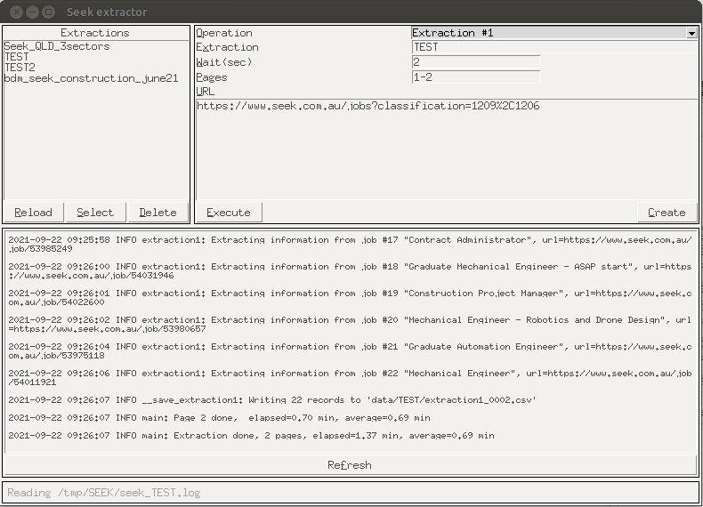
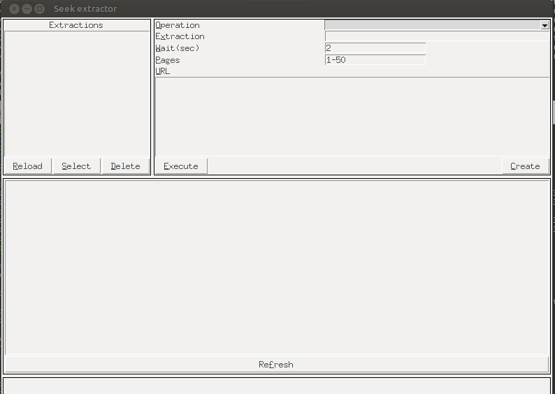

# SEEK Scrapper and Data Analysis (DEMO)

Application to extract and process jobs offers from Seek (https://www.seek.com.au/)

----

# Features:

- Extraction of  jobs offers based on provided url
- Generate .csv and .xlsx 
- Extract job details for each offer
- Filter offers based on agencies and companies
- Configure  number of pages to extract

## Requirements:
- Python 3.x
- Tkinter (if using GUI)

## Screenshots

### GUI 



### Command Line 

### Data extracted 

### Sample csv

```
"title","seekid","url","date","classification","company","location","area","description","date2","status"
"Graduate or Student engineer Mechanical","53783375","https://www.seek.com.au/job/53783375","16d ago","Engineering","Geckon","Melbourne","Eastern Suburbs","Mechanical and Manufacturing Graduates desired","06-09-2021","OK"
...

```


